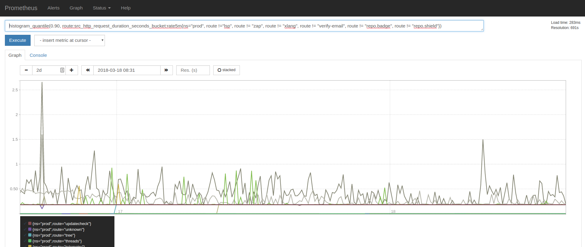

# Prometheus

[Prometheus](https://prometheus.io/) is an open-source application monitoring system and time series database.
 It is commonly used to track key performance metrics over time, such as the following:

- QPS
- Application requests by URL route name
- HTTP response latency
- HTTP error codes
- Time since last search index update



A Prometheus instance is part of the default Sourcegraph cluster installation.

## Developer notes

Ensure changes here are also made in our namespaced overlay [../../overlays/namespaced/](../../overlays/namespaced/)

## Optional Steps

1. Edit `extra.rules` in [prometheus.ConfigMap.yaml](prometheus.ConfigMap.yaml) to define custom [Prometheus recording rules](https://prometheus.io/docs/practices/rules/).

   Here are some example rules:

   ```
   # This is a comment
   myCustomMetric1 = rate(src_http_request_duration_seconds_bucket{job=~"sourcegraph-.*"}[5m])
   myCustomMetric2 = sum by (route, ns, le)(task:src_http_request_duration_seconds_bucket:rate5m)
   ```

1. Apply your changes to Prometheus to the cluster.

   ```bash
   ./kubectl-apply-all.sh
   ```

## Namespaces

If you are deploying Sourcegraph to a non-default namespace, you'll have to change the namespace specified in
[prometheus.ClusterRoleBinding.yaml](prometheus.ClusterRoleBinding.yaml) to the one that you created. You can do this by editing the namespace directly, or by using the [namespaced overlay](../../configure/../overlays/namespaced/README.md).

## Making Prometheus accessible

### Port-forwarding

See [accessing Prometheus directly](https://docs.sourcegraph.com/admin/observability/metrics#accessing-prometheus-directly).

### Kubernetes service

Create a YAML file defining
a
[Kubernetes service](https://kubernetes.io/docs/concepts/services-networking/service/#defining-a-service) that
exposes the Prometheus deployment.

We recommend using a NodePort service with the following configuration:

```yaml
apiVersion: v1
kind: Service
metadata:
  labels:
    app: prometheus
  name: prometheus-node-port
spec:
  externalTrafficPolicy: Cluster
  ports:
    - name: http
      nodePort: 30010
      port: 30010
      protocol: TCP
      targetPort: http
  selector:
    app: prometheus
  type: NodePort
```

(Note: some cloud infrastructure providers support the "LoadBalancer" service type, which
automatically provisions an external load balancer for the service. We recommend against this type
of service for Prometheus, because almost certainly you do NOT want to expose Prometheus to public
Internet traffic.)

After creating the Prometheus service, add the appropriate network ingress rules in your
infrastructure provider to allow trusted incoming traffic to access port 30010 on nodes in the
Kubernetes cluster. SECURITY NOTE: Prometheus is unauthenticated, so whatever incoming traffic the
ingress rules allow will have _complete access_ to the Prometheus UI. Be careful that the ingress
rules restrict incoming traffic to trusted sources.

If a stable IP is required, provision a static IP and an external load balancer in lieu of adding
ingress rules. On most infrastructure providers, the steps are roughly the following:

- Provision the static IP.
- Create an external load balancer. (On AWS, use an "Application Load Balancer".)
- Connect the internal/backend half of the load balancer to the set of nodes in the Kubernetes
  cluster. (On AWS, create a "target group" that contains the instances in the cluster. On Google
  Cloud, define a "target pool".)
- Connect the external/frontend half of the load balancer to the static IP. (On AWS, create a
  "listener rule". On Google Cloud, create a "forwarding rule".)

### Exposing the Prometheus API endpoint

Some customers may want to make the Prometheus API endpoint accessible to other services like the
following:

- An analytics visualization tool like Grafana
(note: an instance of Grafana is part of the default Sourcegraph cluster installation)
- An metrics ingestion pipeline

To expose the Prometheus API to such a service, follow the steps to expose Prometheus via Kubernetes
service with an external load balancer. Ensure that the load balancer permits incoming traffic from
the other service. The [Prometheus API](https://prometheus.io/docs/prometheus/latest/querying/api/)
is reachable under the path `/api/v1`.

## Defining alerts

Sourcegraph ships with a default set of alerts - see [alerting](https://docs.sourcegraph.com/admin/observability/alerting).

Additional rules and alerts can be defined in `extra_rules.yml` - see [Prometheus configuration](https://docs.sourcegraph.com/admin/observability/metrics#prometheus-configuration).

## Metrics

See [metrics and dashboards](https://docs.sourcegraph.com/admin/observability/metrics).
